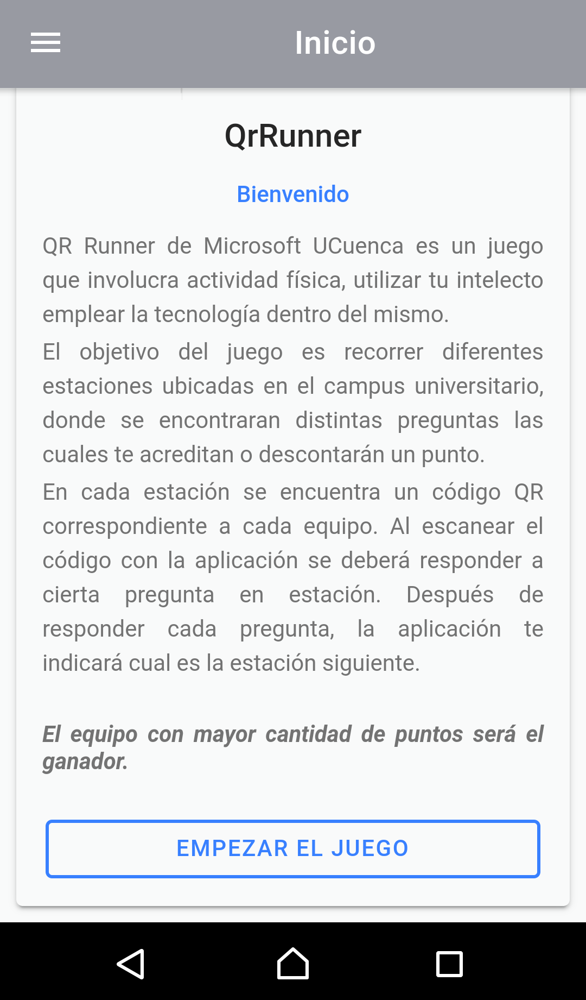

<h1>QrRunner</h1>

<h3>App usando Angular, ionic y capacitor</h3>

QrRunner es una aplicación creada como juego para la semana del Estudiante de la Universidad de Cuenca. Este juego lo realize para la comunidad de Microsoft a la cual pertenezco. Este emplea codigos qr los mismos que tendran un formato de dos valores separados por `,` el primer parametro es acerca de la facultad en la cual esta el codigo y la segunda es para el equipo que debe escanear dicho codigo. Una vez escaneado el codigo y este es correcto estos deberan responder la pregunta planteada, si la respuesta es correcta se sumara un punto caso contrario se restara un punto y el puntaje aparecera al final del concurso. 

<h2>Imagenes del funcionamiento de la app</h2>

Login para insertar los codigos de funcionamiento de la App

Instrucciones del juego

Funcionamiento del juego

Resultados de las respuestas

